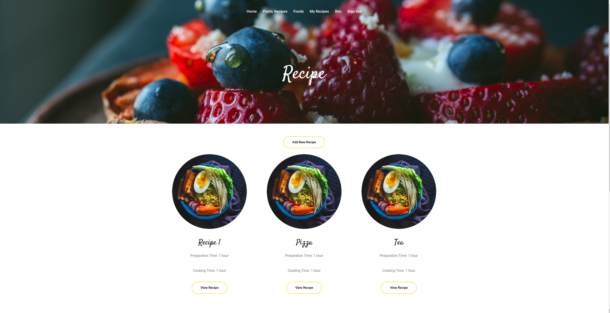

# Rails-cook-book

The Rails cook book  app keeps track of all your recipes and ingredients for the recipe. It will allow you to save ingredients, keep track of what you have, create recipes, and generate a shopping list based on what you have and what you are missing from a recipe. Also, since sharing recipes is an important part of cooking the app should allow you to make them public so anyone can access them.

## Preview



# Getting Started


_To get a local copy up and running follow these simple steps._

1. Clone the repo
   ```sh
   git clone https://github.com/your_username_/Project-Name.git
   ```
2. Goto project directory
   ```sh
   cd recipe-app
   ```
3. Configure Database 
   ```
   change the .env credentials with your postgres username and password 
   run rails db:reset
   ```
4. Run app
   ```sh
   rails server
   ```
   or
   ```sh
   rails s
   ```

# Testing

`bundle exec rspec` will run all the tests.


# This project was built with

- Ruby on Rails

- PostgreSQL

- Bootstrap CSS Framework

# Author 1

👤 **Ben**

- GitHub: [Ben Kiarie](https://github.com/Benmuiruri) - Follow me on Github, browse my projects, and leave a star for any project you like.
- Twitter: [Optimize](https://twitter.com/_optimize) - Follow me on Twitter I will make your Timeline a bit more interesting
- LinkedIn: [Ben Kiarie](https://www.linkedin.com/in/benjamin-kiarie-180b66149/) - Connect with me on LinkedIn lets expand our network for mutual benefits.


# Author 2

👤 **Ezekiel Utshudi**
- GitHub: [@EzekielUtshudi](https://github.com/EzekielUtshudi)


# 🤝 Contributing

Contributions, issues, and feature requests are welcome!

Feel free to check the [issues page](https://github.com/Donard97/recipe-app/issues).

# Show your support

Give a ⭐️ if you like this project!

# Acknowledgement

- Hat tip to anyone whose code was a source of inspiration.
- [Theme Wagon Bootsrap template](https://themewagon.com/themes/free-bootstrap-4-html5-cooking-website-template-tasty-recipes/)

# 📝 License

This project is [MIT](./MIT.md) licensed.
